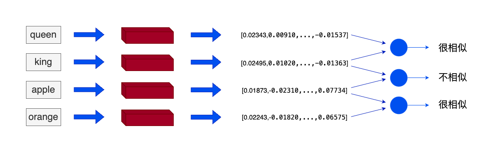
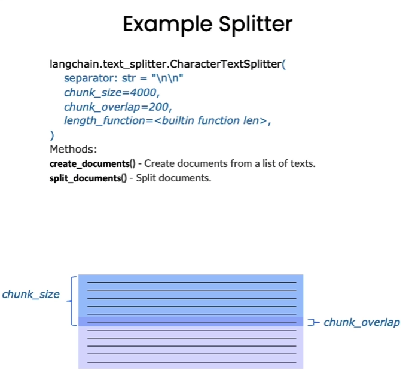

# 1. 向量及向量知识库
## 1.1 词向量与文本向量
1. 词向量(Wrod Embedding)：以单词为单位将每个单词转化为实数向量的技术。背后的理念是相似或相关的对象在向量空间中的距离应该很近
    2. 问题：词向量将单词转化为静态的向量，忽略了单词在不同文本中会表达不同含义的事实

2. 通用文本向量(Universal text embedding)：RAG应用中使用的向量技术，可以对一定范围内任意长度的文本进行向量化，向量化的单位不是单词而是文本，可以捕获更多语义信息
3. RAG(Retrievel Augmented Generation， 检索增强生成)中向量优势主要有：
    1. 向量比文字更适合近似搜索和语义匹配。文字搜索只能通过关键词，而向量因为包含了原文本的语义信息，可以通过计算点积、余弦距离、欧几里得距离等指标，直接获取问题的与数据在语义上的相似度
    2. 向量的综合信息能力更强。向量可以通过多种向量模型将多种数据映射成统一的向量形式，配合上语义信息更容易检索
## 1.2. 向量数据库
1. 向量数据库中的数据以向量作为基本单位，对向量进行存储、处理及检索。向量数据库通过计算与目标向量的余弦距离、点积等获取与目标向量的相似度
    1. Chroma
    2. Weaviate
    3. Qdrant

# 2. 数据处理
## 2.1 数据读取
1. 使用LangChain的`PyMuPDFLoader`来读取知识库的PDF文件、`UnstructuredMarkdownLoader`来读取知识库的MD文件
    - 每页一个文档数据类型(`Document`)，具备两个属性：`page_content`文档的内容，`meta_data`文档的描述性数据
## 2.2 文档分割
1. 考虑单个文档可能超出模型上下文长度限制，需要对文档进行分割，按长度或固定规则分割成若干`chunk`，然后将每个`chunk`转化为词向量存储
2. 检索时将以`chunk`为元单位，每次检索k个`chunk`作为知识，k可设定
3. Langchain中文本分割器都根据 chunk_size (块大小)和 chunk_overlap (块与块之间的重叠大小)进行分割
    - `chunk_size` 指每个块包含的字符或 Token （如单词、句子等）的数量
    - `chunk_overlap` 指两个块之间共享的字符数量，用于保持上下文的连贯性，避免分割丢失上下文信息

# 3. 搭建向量数据库
