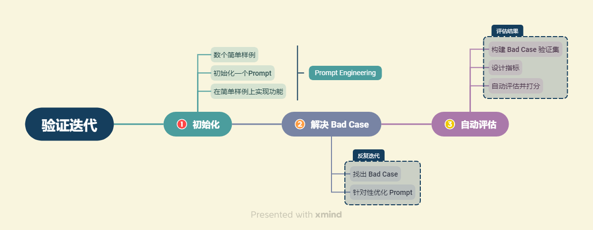

# 如何评估LLM应用
## 1. 验证评估的一般思路
1. 构建LLM应用的步骤：
    - 首先，在数个小样本中调整Prompt，使模型在这些样本上起效
    - 随后，在进一步测试中发现一些棘手的例子，难以用Prompt和算法解决，于是将这些例子加入到正在测试的集合中
    - 最终，逐步扩大的开发集获得足够多的例子，测试变得不方便，于是开发一些用于衡量这些小样本集性能的指标
    

## 2. 大模型评估方法
1. 量化评估：为每个验证案例给出打分，最后计算所有验证案例的平均分得到本版本系统得分
2. 多维评估：需要在多个维度上进行评估
3. 多维&量化评估结合：需要从多个维度出发，设计每个维度的评估指标，在每个维度上都进行打分，从而综合评估系统性能。对每一个维度，可以设置相同的量纲也可以设置不同的量纲，应充分结合业务实际。
4. 举例：对于问答助手，可以从以下几个维度评估：其中1-4围绕知识、回答的正确性展开，与问题高度相关；5-7围绕大模型生成结果的拟人性、语法正确性展开，与问题相关性较小：
    1. 知识查找正确性。该维度需要查看系统从向量数据库查找相关知识片段的中间结果，评估系统查找到的知识片段是否能够对问题做出回答。该维度为0-1评估，即打分为0指查找到的知识片段不能做出回答，打分为1指查找到的知识片段可以做出回答。
    2. 回答一致性。该维度评估系统的回答是否针对用户问题展开，是否有偏题、错误理解题意的情况，该维度量纲同样设计为0~1，0为完全偏题，1为完全切题，中间结果可以任取。
    3. 回答幻觉比例。该维度需要综合系统回答与查找到的知识片段，评估系统的回答是否出现幻觉，幻觉比例有多高。该维度同样设计为0~1,0为全部是模型幻觉，1为没有任何幻觉。
    4. 回答正确性。该维度评估系统回答是否正确，是否充分解答了用户问题，是系统最核心的评估指标之一。该维度可以在0~1之间任意打分。
    5. 逻辑性。该维度评估系统回答是否逻辑连贯，是否出现前后冲突、逻辑混乱的情况。该维度为0-1评估。
    6. 通顺性。该维度评估系统回答是否通顺、合乎语法，可以在0~1之间任意打分。
    7. 智能性。该维度评估系统回答是否拟人化、智能化，是否能充分让用户混淆人工回答与智能回答。该维度可以在0~1之间任意打分。
### 2.1 自动评估模型回答
1. 由于主观题评估在验证集膨胀之后将耗费大量人力，因此在牺牲一定评估准确性的情况下，我们可以将复杂的没有标准答案的主观题进行转化，从而变成有标准答案的问题，进而通过简单的自动评估来实现。
    - 构造客观题
    - 计算标准答案相似度
2. 构造客观题：主观题的评估是非常困难的，但是客观题可以直接对比系统答案与标准答案是否一致，从而实现简单评估。我们可以将部分主观题构造为多项或单项选择的客观题，进而实现简单评估。
    - 举例：对于问题：`【问答题】南瓜书的作者是谁？`，可以构造为：`【多项选择题】南瓜书的作者是谁？   A 周志明 B 谢文睿 C 秦州 D 贾彬彬`。定标准答案为：`BCD`，以此设计打分策略：全选1分，漏选0.5分，错选得-1分，不选不得分（错选和不选要分开，这是两种回答，如果都得0分，会鼓励模型的幻觉现象）：
3. 计算答案相似度：采用人工构造标准答案并计算回答与标准答案相似度的方法来实现自动评估。
    - 举例：对于问题：`南瓜书的目标是什么？`，首先人工构造标准回答：`周志华老师的《机器学习》（西瓜书）是机器学习领域的经典入门教材之一，周老师为了使尽可能多的读者通过西瓜书对机器学习有所了解, 所以在书中对部分公式的推导细节没有详述，但是这对那些想深究公式推导细节的读者来说可能“不太友好”，本书旨在对西瓜书里比较难理解的公式加以解析，以及对部分公式补充具体的推导细节。`，接着对模型回答计算其与该标准回答的相似程度，越相似则我们认为答案正确程度越高。可使用`BLEU`计算相似度（简单理解为主题相似度）。
    - 问题：1. 人工构造标准回答：某些领域可能比较困难；2. 相似度评估存在问题：例如，如果生成回答与标准答案高度一致但在核心的几个地方恰恰相反导致答案完全错误，bleu 得分仍然会很高；3. 通过计算与标准答案一致性灵活性很差，如果模型生成了比标准答案更好的回答，但评估得分反而会降低；4. 无法评估回答的智能性、流畅性。如果回答是各个标准答案中的关键词拼接出来的，我们认为这样的回答是不可用无法理解的，但`BLEU`得分会较高。
4. 使用大模型评估：通过构造`Prompt Engineering`让大模型充当一个评估者的角色。
    - 大模型具有强大的能力，但同样存在能力的边界。使用如下方案提升大模型表现：
        1. 改进 Prompt Engineering。以类似于系统本身 Prompt Engineering 改进的方式，迭代优化评估 Prompt Engineering，尤其是注意是否遵守了 Prompt Engineering 的基本准则、核心建议等；
        2. 拆分评估维度。如果评估维度太多，模型可能会出现错误格式导致返回无法解析，可以考虑将待评估的多个维度拆分，每个维度调用一次大模型进行评估，最后得到统一结果；
        3. 合并评估维度。如果评估维度太细，模型可能无法正确理解以至于评估不正确，可以考虑将待评估的多个维度合并，例如，将逻辑性、通顺性、智能性合并为智能性等；
        4. 提供详细的评估规范。如果没有评估规范，模型很难给出理想的评估结果。可以考虑给出详细、具体的评估规范，从而提升模型的评估能力；
        5. 提供少量示例。模型可能难以理解评估规范，此时可以给出少量评估的示例，供模型参考以实现正确评估。
    - 示例：
    ```
    prompt = '''
        你是一个模型回答评估员。
        接下来，我将给你一个问题、对应的知识片段以及模型根据知识片段对问题的回答。
        请你依次评估以下维度模型回答的表现，分别给出打分：

        ① 知识查找正确性。评估系统给定的知识片段是否能够对问题做出回答。如果知识片段不能做出回答，打分为0；如果知识片段可以做出回答，打分为1。

        ② 回答一致性。评估系统的回答是否针对用户问题展开，是否有偏题、错误理解题意的情况，打分分值在0~1之间，0为完全偏题，1为完全切题。

        ③ 回答幻觉比例。该维度需要综合系统回答与查找到的知识片段，评估系统的回答是否出现幻觉，打分分值在0~1之间,0为全部是模型幻觉，1为没有任何幻觉。

        ④ 回答正确性。该维度评估系统回答是否正确，是否充分解答了用户问题，打分分值在0~1之间，0为完全不正确，1为完全正确。

        ⑤ 逻辑性。该维度评估系统回答是否逻辑连贯，是否出现前后冲突、逻辑混乱的情况。打分分值在0~1之间，0为逻辑完全混乱，1为完全没有逻辑问题。

        ⑥ 通顺性。该维度评估系统回答是否通顺、合乎语法。打分分值在0~1之间，0为语句完全不通顺，1为语句完全通顺没有任何语法问题。

        ⑦ 智能性。该维度评估系统回答是否拟人化、智能化，是否能充分让用户混淆人工回答与智能回答。打分分值在0~1之间，0为非常明显的模型回答，1为与人工回答高度一致。

        你应该是比较严苛的评估员，很少给出满分的高评估。
    '''
    ```
5. 混合评估：多种方法混合使用

# 评估并优化生成部分
1. RAG框架核心：检索和生成。检索部分的核心功能是保证系统根据用户 query 能够查找到对应的答案片段，而生成部分的核心功能即是保证系统在获得了正确的答案片段之后，可以充分发挥大模型能力生成一个满足用户要求的正确回答。
2. 优化大模型应用，需要从这两部分入手，找出`Bad Case`并针对性优化。
3. 标明知识来源，提高可信度，避免模型杜撰不存在于给定资料的知识
4. 构造思维链：如模型幻觉、无法理解复杂指令、无法执行复杂步骤等。
    - 举例：
    ```
    template_v4 = """
    请你依次执行以下步骤：
    ① 使用以下上下文来回答最后的问题。如果你不知道答案，就说你不知道，不要试图编造答案。
    你应该使答案尽可能详细具体，但不要偏题。如果答案比较长，请酌情进行分段，以提高答案的阅读体验。
    如果答案有几点，你应该分点标号回答，让答案清晰具体。
    上下文：
    {context}
    问题: 
    {question}
    有用的回答:
    ② 基于提供的上下文，反思回答中有没有不正确或不是基于上下文得到的内容，如果有，回答你不知道
    确保你执行了每一个步骤，不要跳过任意一个步骤。
    """
5. 增加指令解析：ReAct模式，设置一个LLM来理解指令，判断指令需要执行什么工具，再针对性调用需要执行的工具，其中每一个工具可以是基于不同 Prompt Engineering 的 LLM，也可以是例如数据库、API 等。

# 评估并优化检索部分
## 1. 评估检索效果
1. RAG系统的运作流程如下：

    - 针对用户输入的一个 query，系统会将其转化为向量并在向量数据库中匹配最相关的文本段，然后根据我们的设定选择 3～5 个文本段落和用户的 query 一起交给大模型，再由大模型根据检索到的文本段落回答用户 query 中提出的问题。在这一整个系统中，我们将向量数据库检索相关文本段落的部分称为检索部分，将大模型根据检索到的文本段落进行答案生成的部分称为生成部分。
2. 检索准确率：对于N个给定query，假定检索到的片段能正确回答M个query，那么$accuracy = \frac{M}{N}$
3. 该公式比较简单，也可将检索过程建模为一个经典的搜索任务，就可以引入搜索算法中经典的评估思路（如准确率、召回率等）和优化思路（例如构建索引、重排等）来更充分地评估优化检索效果。
## 2. 优化检索的思路
1. 解决由知识库构建带来的Bad Case：
    - **知识片段被割裂导致答案丢失**：知识库在构建时将正确答案分割开，导致不能形成完整、合理的答案。
        - 优化文本切割方式。对于格式统一、组织清晰的文档，针对性构建合适的分割规则；对于格式混乱、无法形成统一的分割规则的文档，考虑人力分割；也可以训练一个专用于文本分割的模型，实现语义分割。
    - **query提问需要长上下文概括回答**：需要跨越多个chunk来综合回答问题，但受限于模型上下文限制，难以给出足够chunk数。
        - 针对回答这类问题的长文档，通过使用LLM对文档进行概括总结，或者预设提问让LLM作出回答，从而将可能答案作为单独chunk填入知识库
    - **关键词误报**：对于一个query，系统检索到多个知识片段均有与query强相关的关键词，但某些片段并非对query做出的回答。
        - 该类问题优化思路是改写用户query，即对于用户输入 query，我们首先通过 LLM 来将用户 query 改写成一种合理的形式，去除次要关键词以及可能出现的错字、漏字的影响。可以要求 LLM 对 query 进行提炼形成 Json 对象，也可以要求 LLM 对 query 进行扩写等。
    - **匹配关系不合理**：匹配到的强相关文本段并没有包含答案文本。
        - 该问题的核心问题在于，向量模型的配对方式不符合我们的要求。举例：query：“今天天气怎么样”，在语义相似度向量模型的匹配下，会更倾向于”我想知道今天天气”，而非“天气不错”。一般优化思路是优化向量模型或构建倒排索引。